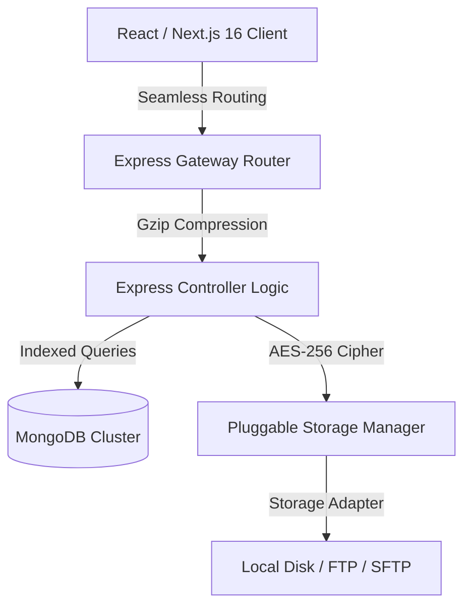

# Phoenix XShare 3.0
> **Enterprise-grade client-side encryption. Seamless folder pipelines. High-performance caching and Gzip delivery.**

---

<p align="center">
  
  
  
  
</p>

Phoenix XShare 3.0 is a secure, high-performance file sharing portal built on Next.js and Express. It features pluggable storage adapters (supporting Local, FTP, and SFTP), zero-knowledge metadata resolution, dynamic PWA capabilities, and an advanced client-side cryptographic system.

---

## Key Upgrades in Version 3.0

### State-Driven Seamless Navigation
The directory navigation workflow has been completely overhauled to eliminate latency and display jumps:
* **Background Data Prefetching**: Clicking folders or breadcrumbs initiates instantaneous UI state changes and data fetches.
* **Shimmering Cyber Skeletons**: Employs custom CSS pulse-animated skeletons styled to match the cyber-cyan interface theme during loading phases.
* **Scroll Position Preservation**: Standard router jumps are locked (`scroll: false`), ensuring smooth, in-place transitions.
* **Reactive Navigation Hooks**: Built-in compatibility with browser back and forward actions to synchronize application states smoothly.

### Symmetrical Link-Share Engine
Direct API exposure and raw download buttons have been replaced with a unified sharing and packaging system:
* **One-Click Share Links**: Both directories and assets generate shared links (`/download/folder-xxxx`) directly copied to the clipboard.
* **Unified Public Gateway**: Public download portals recognize folder metadata, providing distinct directory styles (`🗂`), asset manifests, and instant recursive ZIP packaging.

### Bandwidth & Query Optimization
* **Gzip Payload Compression**: Enabled compression across all Express routes to decrease transit sizes of JSON endpoints and static assets.
* **Supercharged MongoDB Indexing**: Added composite index models on startup to accelerate catalog retrievals to sub-millisecond speeds.

---

## System Architecture



* **Frontend**: Next.js 16 (App Router), Vanilla CSS, React Hooks, HTML5 Drag & Drop.
* **Backend**: Express.js, `express-fileupload`, `basic-ftp`, `ssh2-sftp-client`.
* **Database**: MongoDB (Sessions + Upload Catalog + Cipher Registry).
* **Security**: Client-side AES-256-CBC envelope encryption, session tokens, rate limiting.

---

## Cryptographic Integrity
1. **Entropy Injection**: Unique 128-bit Initialization Vector (IV) and 256-bit symmetric keys are generated dynamically in-memory per file.
2. **Database Separation**: Decryption keys are isolated in the `encryption_Data` collection and are never exposed on standard file schemas.
3. **Recursive In-Memory Zipping**: Directories are zipped dynamically. Binaries are fetched and decrypted on the fly in-memory, avoiding temporary storage of decrypted plain text on server disks.

---

## Directory Structure
```
├── backend/
│   ├── config/              # Credentials and server settings
│   ├── src/
│   │   ├── controllers/     # Main controller logic (Auth, Upload, Cryptography)
│   │   ├── middleware/      # Authentication checks, rate limiters
│   │   ├── routes/          # Express route declarations
│   │   ├── utils/           # DB connectors, FTP clients, encryption helpers
│   │   └── index.js         # API Gateway Entry Point
│   └── package.json
├── frontend/
│   ├── app/                 # Next.js App Router
│   │   ├── dashboard/       # Main operator dashboard
│   │   ├── download/        # Public download gateway
│   │   ├── view/            # Live preview frame (Images, Video, Text, Audio)
│   │   ├── globals.css      # Design system token definitions
│   │   └── layout.js        # Global App wrapper
│   └── package.json
└── package.json             # Monorepo workspace control
```

---

## Getting Started

### 1. Environment Configuration
Create or edit `config/config.js` with your environment parameters:
```javascript
export default {
  settings: {
    port: 5000,
    mongoURI: "mongodb://127.0.0.1:27017/phoenix-xshare",
    storageProvider: "local", // local, ftp, or sftp
    encryption: true,         // auto AES-256
    domain: "http://localhost:3000"
  }
};
```

### 2. Installation and Startup
Ensure Node.js and MongoDB are running, then execute:
```bash
# Install dependencies across monorepo workspaces
npm run install:all

# Run both services concurrently (API: 5000, Client: 3000)
npm run dev
```

---

<p align="center">
  Developed by the Phoenix-XShare Core Team. Released under the MIT License.
</p>
